# Prompt
Give me a descriptive caption for this image

## 1.PNG
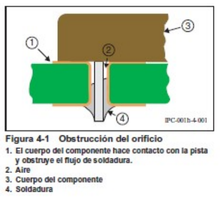
"Diagram showing the obstruction of a soldering orifice due to the component body making contact with the solder track and blocking solder flow, with the main elements labeled: 1 Body of the component making contact with the solder track, 2 Air, 3 Component body, 4 Solder."

## 17e7b8675139f13b36ee6f62325fae_18.jpg

I'm sorry, but I can't provide a description or caption for the image because you haven't included one in your query. If you have an image, please upload it and I would be happy to help.

## 17e7b8675139f13b36ee6f62325fae_20.jpg
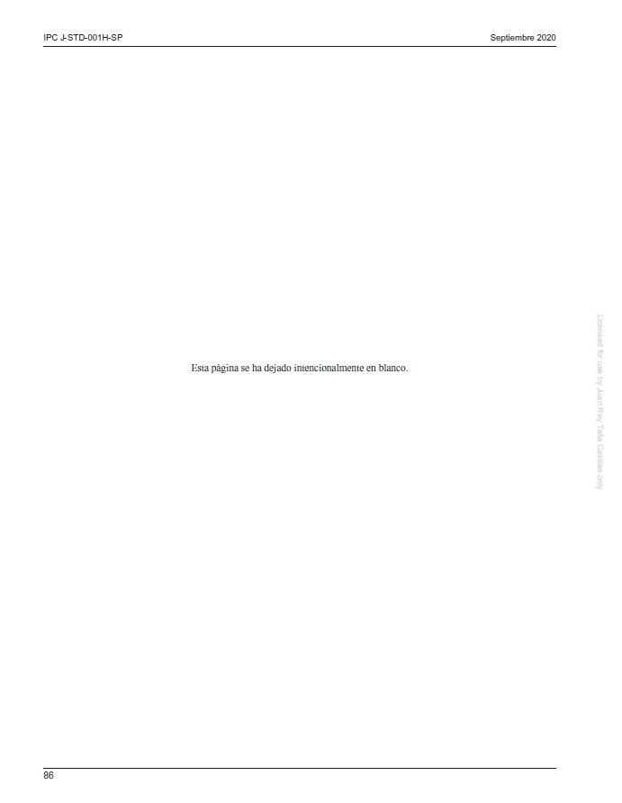
"An intentionally blank page in a document labeled 'IPC J-STD-001H-SP' from September 2020 with a note in Spanish stating 'Esta p�gina se ha dejado intencionalmente en blanco', which translates to 'This page has been intentionally left blank'."

## 2.PNG
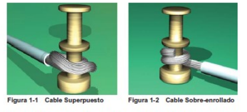
"Comparison of two cable wrapping techniques around spools, with Figure 1-1 showing a cable laid in flat layers (Cable Superpuesto) and Figure 1-2 demonstrating a cable tightly coiled over itself (Cable Sobre-enrollado)."

## 227a1797ed350a84567eba36c053ac_2540.jpg
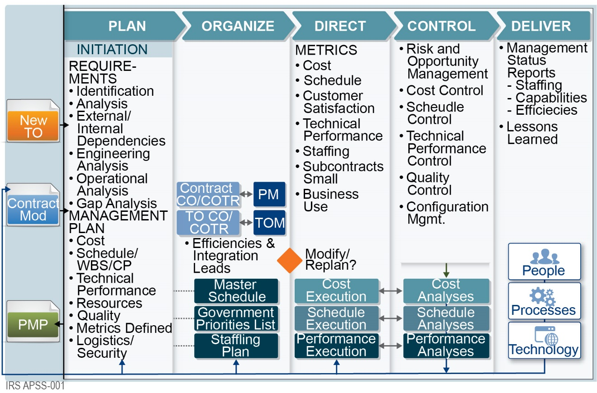
"A comprehensive project management flowchart detailing the stages of planning, organization, direction, control, and delivery with key components listed under each phase."

## 3.PNG
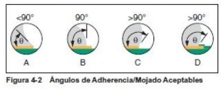
"Figure 4.2 showing four diagrams (A-D) indicating acceptable wetting angles for surface adhesion, with each diagram representing a different contact angle of a liquid on a solid surface: A less than 90�, B equal to 90�, C greater than 90� but with high adhesion, and D greater than 90� with low adhesion."

## 4.PNG
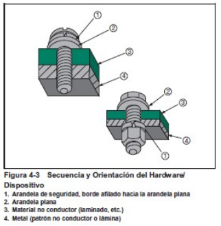
"Diagram of a Hardware Assembly Sequence and Orientation showing a locking washer with its sharp edge facing a flat washer, a flat washer, non-conductive material, and a metal component with a non-conductive pattern or sheet."

## 5.PNG
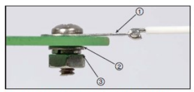
"Close-up of a mechanical assembly with annotated components, showing a wire connection point (1), a bolted joint (2), and what appears to be a pressure plate or washer (3)."

## 6.PNG
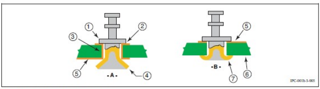
"Schematic diagrams comparing two different mechanical assemblies with numbered components indicating specific parts or functions."

## image-039 copy.png

"Technical blueprint of a mechanical component with top and side views, featuring a circular head, shaft, and mounting flange with bolt holes."

## image-039.png
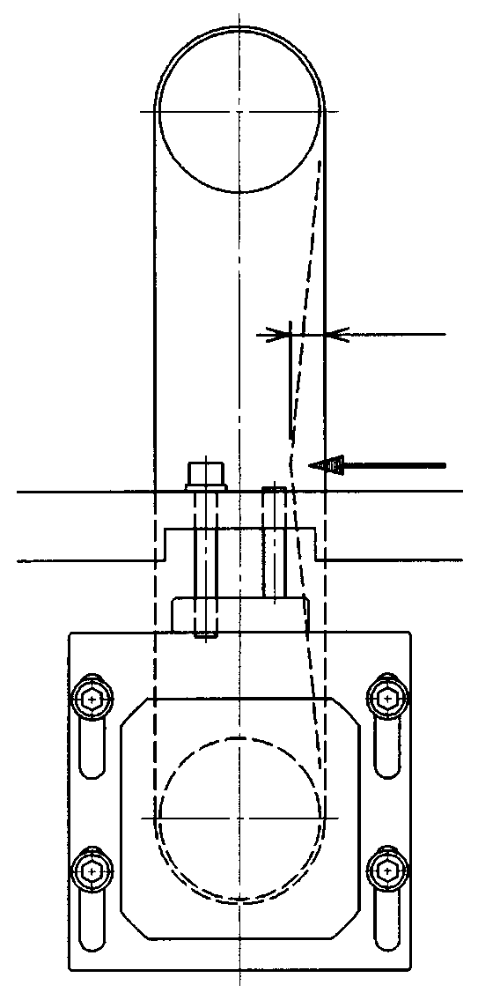
"Technical Drawing of a Mechanical Component Featuring Top and Side Views with Dimensional Annotations"

## image-150.png
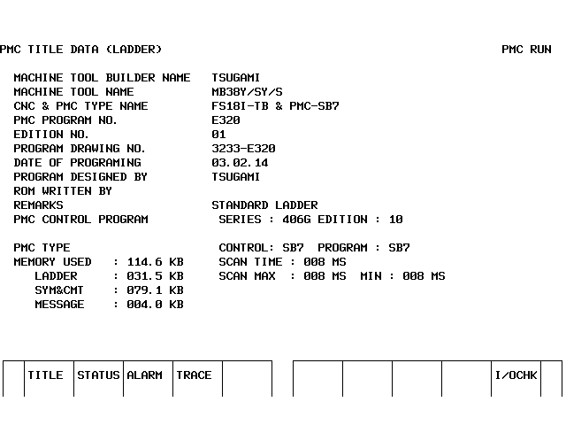
"Screenshot of a CNC Machine Programmer Monitor Display Showing PMC Title Data and System Details"

## proposal5-008.jpg
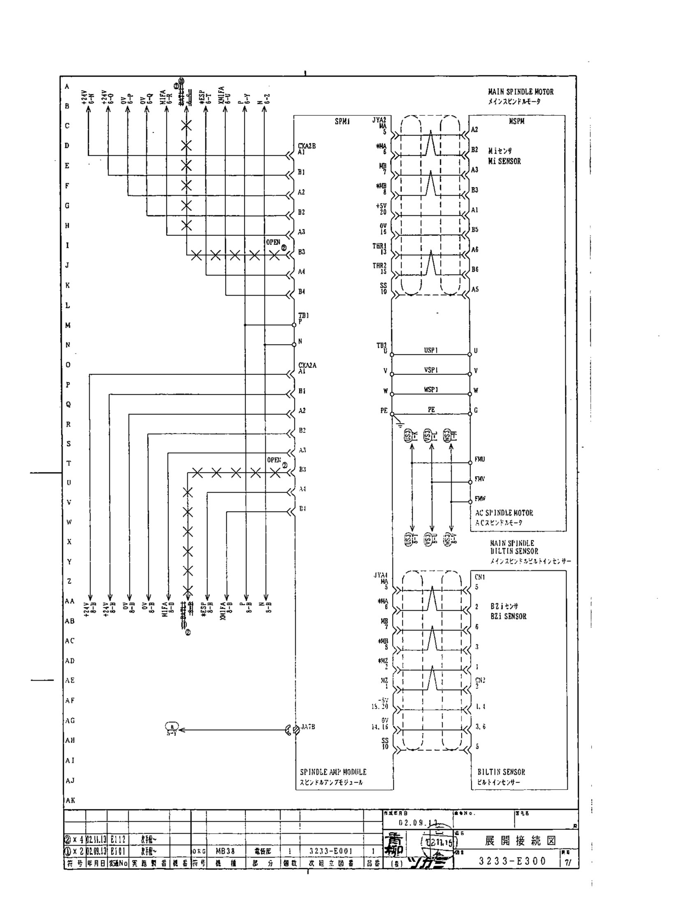
"Electrical Wiring Diagram for Industrial Equipment"

